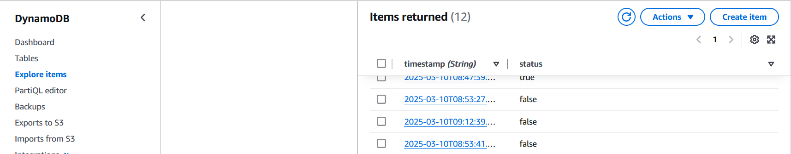
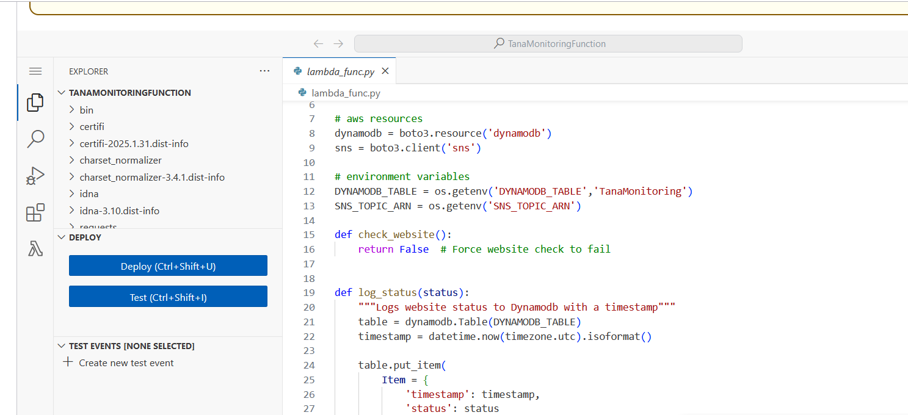
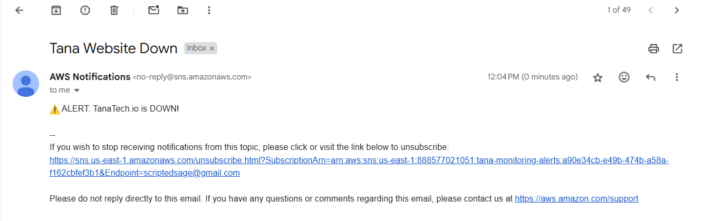

# Tana Website Uptime Monitoring 🚀

## Overview
This project is a **serverless monitoring solution** that checks the uptime of [Tana's website](https://tana.inc) every **5 minutes**. If the website is **down**, an **SNS notification** is triggered, and the status is logged in **DynamoDB** for further analysis. This was built as part of a **DevOps learning project** to demonstrate AWS automation and observability.

## Tech Stack 🛠️
- **AWS Lambda** – Runs the uptime check every 5 minutes
- **Amazon CloudWatch** – Triggers Lambda & monitors logs
- **Amazon SNS** – Sends alerts if the website is down
- **Amazon DynamoDB** – Stores uptime history
- **Terraform** – Infrastructure as Code (IaC) deployment
- **GitHub Actions** – Automates Lambda deployments


## Features 🔥
✅ **Automated Monitoring** – Website uptime is checked every **5 minutes**  
✅ **Instant Alerts** – If the site is down, SNS sends a notification  
✅ **Historical Data Storage** – DynamoDB logs the uptime history  
✅ **Infrastructure as Code** – Terraform manages AWS resources  
✅ **CI/CD Pipeline** – GitHub Actions automates Lambda updates  

## Screenshots 📸








---

## Deployment & Setup 🚀
### Prerequisites
- AWS account with IAM permissions
- Terraform & AWS CLI configured with a profile
- GitHub repository for CI/CD

### 1️⃣ Deploy Infrastructure with Terraform
```sh
terraform init
terraform apply -auto-approve
```

### 2️⃣ Package & Upload Lambda Code
```sh
cd lambda
pip install -r requirements.txt -t .
zip -r package.zip .
aws lambda update-function-code --function-name TanaMonitoringFunction --zip-file fileb://package.zip --profile <your-aws-profile>
```

### 3️⃣ Subscribe to SNS Alerts
- Go to **AWS SNS Console**
- Find the **tana_alerts** topic
- Subscribe with your email or phone number
- Confirm the subscription

### 4️⃣ Test Lambda Manually
```sh
aws lambda invoke --function-name TanaMonitoringFunction output.json --profile <your-aws-profile>
cat output.json
```

---

## Future Improvements 🚀
🔹 Add a **Grafana dashboard** for better visualization  
🔹 Store **response times** for performance analysis  
🔹 Improve **error handling** in the Lambda function  

## Why This Project? 🤔
This project was created to showcase **real-world DevOps automation** using AWS. The goal was to:
- Implement a **serverless monitoring solution**.
- Gain hands-on experience with **CloudWatch, SNS, and Lambda**.
- Demonstrate **IaC (Terraform) and CI/CD (GitHub Actions)** in action.

## Contact 💬
Feel free to reach out for questions or feedback!

---

